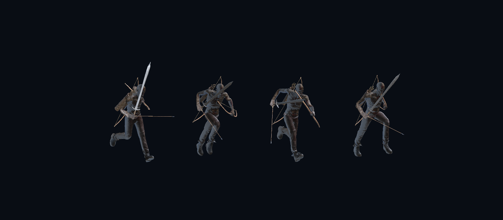

# 돌진 전용 달리기 모션 적용

## 완료 기준

- STR·CON의 공용 돌진에 새로 가져온 달리기 모션을 적용한다.
- 돌진이 유지되는 동안 반복 재생하며, 이동속도에 따라 발걸음 속도가 변한다.
- 공격·돌진 종료·사망 시 달리기가 다른 모션을 덮지 않는다.
- 실제 이동은 기존 서버/CharacterController가 담당하며 애니메이션 루트 모션으로 추가 이동하지 않는다.
- 전체 스킬 설치를 다시 실행해도 새 달리기 모션이 유지된다.

## 적용 내용

기존 `SHARED_Charge.anim`은 걷기 클립을 짧게 압축한 모션이었고, 상태에 자동 종료 전이가 있어 돌진보다 먼저 끝났다.

Quaternius의 [Universal Animation Library](https://quaternius.com/packs/universalanimationlibrary.html) 무료 Standard 패키지에서 `Sprint_Loop`를 가져왔다. CC0 원본 라이선스와 FBX를 `Assets/Remodel/Skills/Source/Quaternius`에 함께 저장했다. Humanoid 리타게팅을 거친 0.667초 반복 클립을 기존 애니메이션 에셋에 복사하여 참조 GUID를 유지했다.

- `SkillExpansionInstaller`: 새 소스 클립을 추출하고 돌진 상태의 시간 기반 자동 종료를 제거한다. 전용 메뉴 `Battle PvP > Skills > Apply Charge Run Animation`으로 해당 모션만 재적용할 수 있다.
- `Player.controller`: 돌진 상태에 기존 `LocomotionRate`를 연결한다. `PlayerManager`가 계산하는 실제 수평 이동 거리 기반 속도 보정과 Animator 전체 속도 보정을 그대로 사용한다.
- `SkillExpansionVisuals`: 동기화된 돌진 상태가 유지되는 동안 달리기 루프를 유지·복원하고, 종료 시 기본 레이어로 돌아간다.
- `ExpandedSkillController.NotifyAttackStarted`: 서버 상태 도착을 기다리는 클라이언트에서도 달리기 레이어를 즉시 해제해 공격 모션이 덮이지 않게 한다.

돌진의 이동속도·가속 시간·피해량·쿨타임은 변경하지 않았다.

## 검증

Unity MCP를 통해 실제 `Player.prefab`과 Animator를 편집기에서 검사했다.

- 기존 스킬 EditMode 테스트 **23개 통과, 실패 0개** (`Reports/ChargeAnimation/editmode-result.json`).
- Animator 검사 **7항목 통과** (`Reports/ChargeAnimation/animation-checks.txt`): 여러 주기 반복, 루트 위치 유지, 이동속도 배율 반영, 서버 상태가 아직 유지되는 상황에서 공격 취소, 다음 돌진 재시작, 종료 후 복귀, 시작 연출 없이 동기화 상태로 모션 복원 및 정리. 첫 항목에는 루트 위치 검사를 함께 포함한다.
- 새 모션의 네 시점을 실제 캐릭터로 렌더링해 리타게팅 자세를 확인했다 (`Reports/ChargeAnimation/run-cycle.png`).
- Unity 컴파일 오류 없음. 실제 네트워크 8인 플레이나 Windows 재빌드는 이번 작업에 포함하지 않았다.

