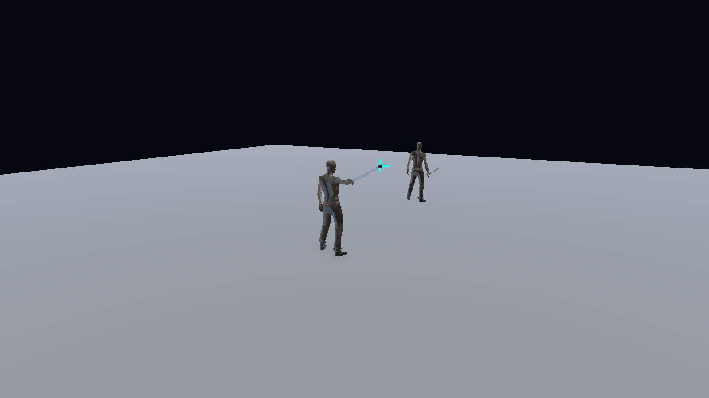
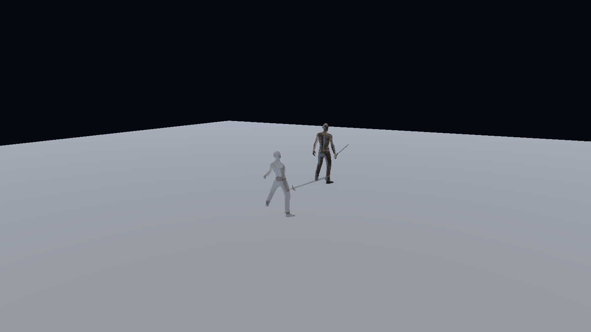
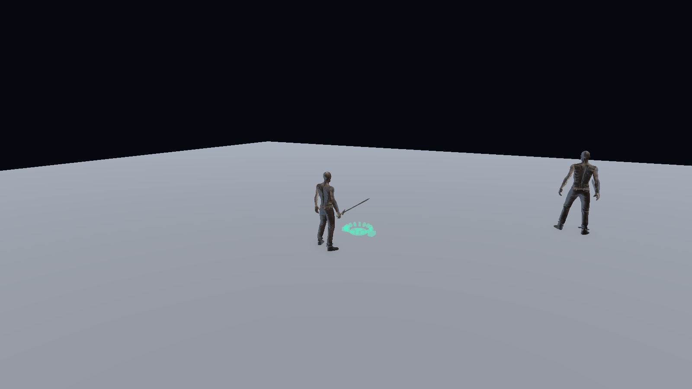

# 은신·갈고리·나이프·덫 조작 및 모션 개선

> 이 문서는 최초 적용 기록이다. 이후 보고된 모션 누락과 어색한 자세를 수정한 최신 내용·시전 시간·검증 결과는 [스킬 모션 재작업 기록](SKILL_MOTION_REWORK_2026-10-04.md)을 참고한다. 아래 초기 수치는 현재 설정과 다를 수 있다.

## 완료 기준과 적용 내용

| 항목 | 완료 기준 | 적용 내용 |
| --- | --- | --- |
| 은신 | 본인 알파 0.5, 다른 플레이어에게 완전히 숨김, 해제 시 복원 | 본인은 원본 재질을 변경하지 않고 투명 재질 복사본을 사용한다. 관찰자는 몸·무기·자식 렌더러·이름표 Canvas를 숨긴다. 새로 생긴 렌더러도 처리하며 종료·사망·프리셋 변경 시 복원한다. |
| 갈고리 | 오른팔 전방 투척, 쇠사슬 연결, 사거리 6유닛 | 공용 오른팔 투척 모션의 손을 뻗는 시점에 발사한다. 손과 갈고리 사이를 교차하는 고리 형태의 동적 메시로 연결하며 명중 대상의 이동을 따라간다. 발사·회수 중 이동과 공격은 잠긴다. |
| 나이프 | 오른팔을 뒤로 당긴 준비 루프, 하체는 걷기·대기·앉기 유지 | `ExpandedUpperBody`와 AvatarMask로 몸통·오른팔만 덮는다. 작은 호흡·팔 흔들림을 넣었으며, 갈고리와 투척 클립을 공유한다. Q/E로 준비·취소, 좌클릭으로 투척한다. |
| 덫 | 스킬 키로 바로 앞 바닥 미리보기, 클릭으로 설치, 앉아서 조립 | 앞쪽 1.2유닛의 바닥에 설치 가능하면 청록색, 불가능하면 빨간색 미리보기를 표시한다. 좌클릭 확정 후 1.2초 동안 무릎을 꿇고 조립한 뒤 실제 덫을 생성한다. 다시 스킬 키를 누르면 준비를 취소한다. |

덫 미리보기는 로컬에만 표시한다. 준비·잘못된 위치 클릭·준비 취소는 쿨타임과 복제한 덫을 소비하지 않는다. 설치가 확정될 때 쿨타임이 시작된다. 서버가 바닥, 경사, 발판 네 모서리, 설치 공간, 플레이어와 바닥 사이 장애물, 요청 위치를 다시 검사한다. 준비 없이 보내는 설치 요청, 비정상 좌표, 먼 위치 요청을 거부한다.

벽을 통과한 손에서 투사체가 발사되지 않도록 발사 원점도 검사한다. 갈고리·덫의 시전 식별자를 사용해 취소된 코루틴이 다음 스킬의 잠금을 해제하거나 이전 위치에 덫을 생성하지 못하도록 했다. 갈고리 시각화는 RPC가 SyncVar보다 먼저 도착하는 순서를 고려한다.

## 데이터·리소스

- `GameData/GameData_Skill.xlsx`: 갈고리 Range 6, 은신 LocalAlpha 0.5, 갈고리/나이프 발사 시점 0.20/0.15초, 시전 시간 0.55/0.4/1.2초를 반영했다.
- `GameData/GameData_String.xlsx`: 네 스킬의 한국어·영어 설명과 덫 설치 안내 문자열을 갱신했다.
- `Assets/Resources/SkillGameData.asset`: Excel을 다시 가져와 실제 게임 데이터와 설명에 적용했다.
- `Tools/SkillExpansion/update_skill_interactions.mjs`: 기존 행의 식별자로 수정한다. 초기 생성기로 전체 데이터를 다시 만드는 방식이 아니다.
- `Assets/Remodel/Skills/Animations/AGI_KnifeReady.anim`, `SHARED_RightArmThrow.anim`, `ThrowUpperBody.mask`: 준비 루프와 상체 전용 투척 모션.
- `SHARED_Trap.anim`: 프로젝트에 가져온 Quaternius Universal Animation Library의 CC0 `Fixing_Kneeling` 전체 모션을 Humanoid로 리타게팅하고 시전 시간에 맞춰 재생한다. 라이선스·출처는 `Assets/Remodel/Skills/Source/Quaternius`에 보관했다.
- `Battle PvP > Skills > Apply Skill Interaction Motions` 메뉴로 데이터·모션·Animator 연결을 재적용할 수 있다. 전체 스킬 설치에서도 호출하므로 다시 설치해도 유지된다.

## 검증

- Unity MCP로 실제 프로젝트에 적용하고 컴파일 오류가 없는지 확인했다.
- EditMode 테스트 **29개 통과**: 데이터/문자열 검증, 은신 재질 복원과 상대 숨김, 나이프 하체 마스크, 덫 준비 취소·복제 스킬 보존, 벽/낭떠러지/조작된 위치 거부, 취소된 시전 격리를 검사했다. 최종 결과는 `Reports/SkillInteractions/editmode-tests.json`에 기록했다.
- Unity 네이티브 Play Mode: 스킬 동작과 6개 직업 UI 설명의 넘침 검사 **243항목 통과**, 실행 중 오류 0개. 5.4유닛 거리의 갈고리 명중·끌어오기, 쇠사슬 메시 생성, 나이프 피해, 은신 알파와 상대 숨김, 덫 미리보기·조립 대기·피해·속박을 확인했다.
- `Reports/SkillExpansion/native.json`과 `native-hook-chain.png`, `native-stealth-local.png`, `native-stealth-observer.png`, `native-trap-preview.png`, `native-trap-assembly.png`에 결과를 저장했다. 최종 사본은 `Reports/SkillInteractions`에도 보관한다.
- 검증 후 원래 Login 씬과 편집 모드로 복귀했다. 네트워크의 상대 숨김 분기는 편집기에서 관찰자 조건을 직접 적용해 검사했다. 실제 별도 PC 간 네트워크 플레이와 Windows 재빌드는 수행하지 않았다.

