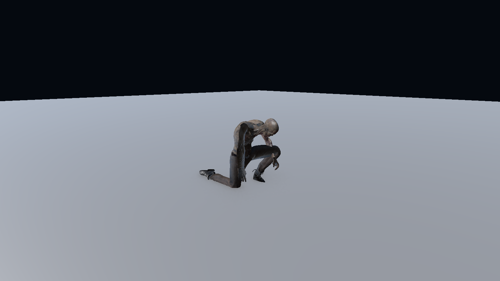

# 덫·갈고리·나이프 모션 재작업 — 2026-10-04

## 문제와 수정

스킬 입력 직후 Animator가 새 상태를 평가하기 전에 시각화 코드가 이전 Empty 상태를 읽고 레이어 가중치를 0으로 되돌리는 문제가 있었다. 요청한 상태가 실제로 반영될 때까지 가중치를 유지하도록 수정했다. 또한 기존 캐릭터의 CullUpdateTransforms 설정 때문에 화면 밖에서는 손·골반의 뼈 갱신이 생략될 수 있었다. 스킬 연출 중에는 AlwaysAnimate를 사용하고 종료·취소 시 원래 설정을 복원한다.

| 항목 | 완료 기준 | 적용 결과 |
| --- | --- | --- |
| 덫 | 설치 확정 후 실제로 무릎을 꿇고 손으로 조립하며, 동작 종료 후 덫 생성 | Quaternius Fixing_Kneeling 전체 동작을 2.2초에 재생한다. 골반이 낮아지는 만큼 FPS 카메라도 부드럽게 내려간다. 일반 앉기와 중복해 두 배로 내려가지 않는다. |
| 갈고리 투척 | 손에 갈고리를 들고 오른팔을 뒤로 빼서 던짐 | 무료 OverhandThrow 모션으로 교체하고 손이 전방으로 나오는 시점에 투사체를 발사한다. 기존 6유닛 사거리와 쇠사슬 연결은 유지한다. |
| 갈고리 회수 | 투척과 별도 동작, 적중·빗나감 모두 회수 후 행동 가능 | HookRetrieve 상태를 추가했다. 서버가 회수 시작·기간을 결정하며 쇠사슬과 갈고리 이동, 대상 끌어오기, 행동 잠금 시간을 맞춘다. |
| 나이프 | 자연스러운 상체 준비·투척, 하체 이동 유지 | OverhandThrow의 준비 자세를 추출해 미세한 상체 움직임을 넣었다. 몸통·양팔·손가락만 덮는 마스크를 사용해 걷기·앉기·대기를 유지한다. 무료 나이프 모델을 손잡이에 맞춰 배치했다. |

시전 취소·기절·스킬 변경 시 남은 연출, 손의 소품, 레이어 상태와 행동 잠금도 정리한다. 기존 시전의 코루틴이 다음 시전의 잠금을 풀지 않도록 식별자 검사를 유지했다.

## 무료 에셋과 사용 방식

모든 출처와 라이선스 사본은 `Assets/Remodel/Skills/Source`에 보관했다.

| 용도 | 원본·라이선스 | 적용 방식 |
| --- | --- | --- |
| 투척 | [Quaternius Universal Animation Library 2](https://quaternius.itch.io/universal-animation-library-2), CC0 | OverhandThrow를 Humanoid로 리타게팅. 갈고리는 0–40프레임, 나이프는 8–40프레임 사용. |
| 회수 | 같은 라이브러리의 Melee_Hook_Rec, CC0 | 펀치 복귀 모션의 0–18프레임을 끌어당기는 회수 동작으로 응용했다. 전용 로프 회수 원본 애니메이션은 아니다. |
| 덫 조립 | [Quaternius Universal Animation Library](https://quaternius.itch.io/universal-animation-library), CC0 | 기존에 가져온 Fixing_Kneeling 0–156프레임 전체 사용. |
| 나이프 | [Quaternius Toon Shooter Game Kit](https://quaternius.com/packs/toonshootergamekit.html), CC0 | Knife_1.fbx 원본 형상, 길이 0.38m와 손잡이 위치 조정, 공용 URP 금속 재질 적용. |
| 갈고리 | [azureguy — Grappling Hook](https://opengameart.org/content/grappling-hook), CC0 | 원본 SVG의 갈고리 윤곽을 두께가 있는 0.5m 메시로 변환했다. 완성된 외부 3D 모델을 가져온 것이 아니라 무료 2D 도안을 입체화한 모델이다. 로프 그림은 제외하고 기존 동적 쇠사슬을 연결했다. |

외부 스크립트나 플러그인은 추가하지 않았다.

## 현재 데이터

| 설정 | 값 |
| --- | ---: |
| 갈고리 사거리 | 6유닛 |
| 갈고리 발사 지연 | 0.24초 |
| 갈고리 시전 시간 데이터 | 0.85초 |
| 갈고리 최소 회수 시간 | 0.6초 |
| 갈고리 쿨타임 | 15초 |
| 나이프 발사 지연 | 0.10초 |
| 나이프 시전 시간 | 0.55초 |
| 덫 설치 시간 | 2.2초 |

갈고리의 실제 행동 잠금은 단순히 0.85초 후 해제하는 방식이 아니다. 비행·끌어오기·회수 단계가 끝날 때 해제하며, 거리에 따라 회수 시간이 늘어날 수 있다.

`GameData/GameData_Skill.xlsx`의 기존 식별자를 유지해 값을 수정하고 `GameData_String.xlsx`를 함께 내보냈다. `Assets/Resources/SkillGameData.asset`에 다시 가져와 실제 스킬과 설명에 반영했다. 문자열은 기존 치환 규칙으로 최신 수치를 표시한다.

## 재생성 경로

- `Battle PvP > Skills > Apply Skill Interaction Motions`: 모션·마스크·Animator·소품·데이터 적용. 전체 스킬 설치도 마지막에 이 처리를 호출한다.
- `Tools/SkillExpansion/update_skill_interactions.mjs`: 기존 Excel 행을 갱신한다.
- `Tools/SkillExpansion/build_hook_mesh.py`: 보관된 SVG를 읽어 갈고리 OBJ를 생성한다.
- `Assets/Remodel/Editor/SkillPropInstaller.cs`: 기존 프리팹 GUID를 유지하며 가져온 소품과 재질을 적용한다.

## 검증 결과

- Unity 6000.3.15f1에서 설치·컴파일 완료. Mirror Weaver 컴파일 오류 없음.
- EditMode 회귀 테스트 **79/79 통과**, 실패·건너뜀 0. 스킬 데이터, 입력, FPS 카메라, 상태 전환 전 레이어 유지, 컬링 설정 복원, 회수 잠금과 기절 취소를 포함한다. 결과: `Reports/SkillMotions/edit-tests.xml`.
- Unity 네이티브 Play Mode **253개 확인 항목 통과**, 오류 0. 이 숫자에는 직업 UI 문구 넘침 검사도 포함되며 253개의 독립 단위 테스트를 뜻하지 않는다. 결과: `Reports/SkillExpansion/native.json`.
- 실제 캐릭터 뼈를 관측해 갈고리 투척의 손 상승, 덫 설치의 골반·손 하강을 확인했다. 갈고리의 적중·빗나감 후 회수, 대상 끌어오기와 잠금 해제, 나이프 피해·충전 소모도 확인했다.
- 네이티브 캡처를 직접 확인했다: `native-hook-windup.png`, `native-hook-chain.png`, `native-hook-retrieve.png`, `native-knife-ready.png`, `native-trap-assembly-close.png` (`Reports/SkillExpansion`).
- Excel 내 시전·발사·회수 수치와 가져온 게임 데이터를 확인했다.

이번 검증은 격리된 Unity 네이티브 Play Mode에서 수행했다. 웹 빌드는 사용하지 않았다. 실제 두 클라이언트 간 플레이, 8인 성능 측정, 새 Windows 배포 빌드는 이번 요청에서 수행하지 않았다. 검증 장면의 고정 시뮬레이션 간격은 60 FPS 성능 달성을 증명하지 않는다.

