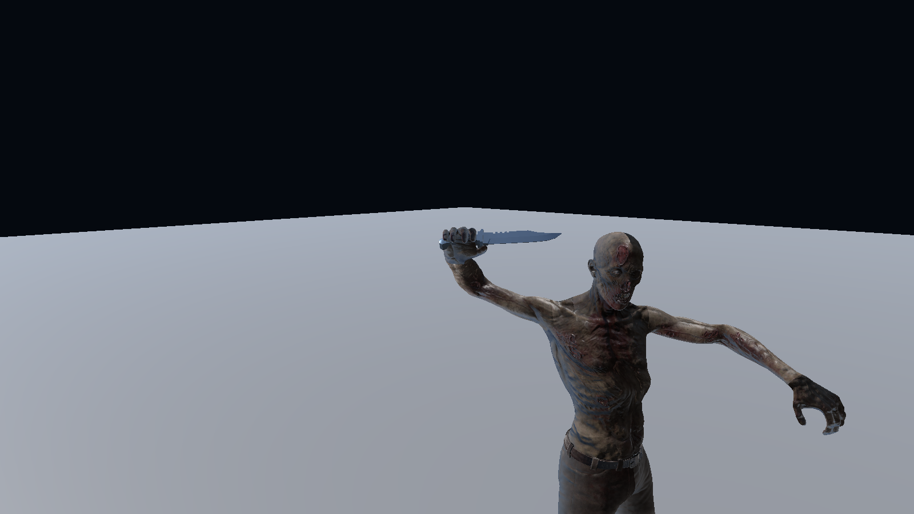
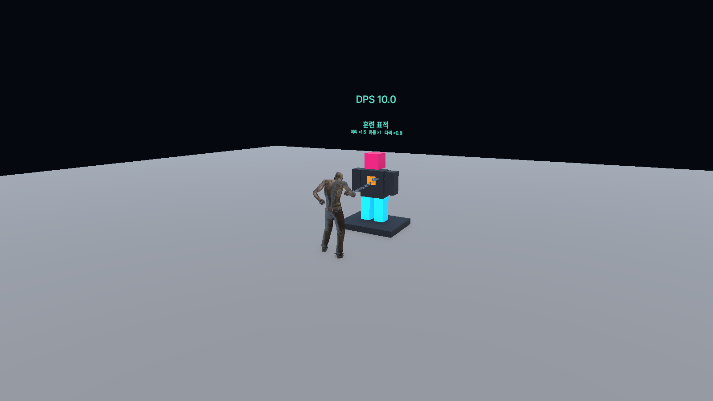

# 허수아비 DPS·갈고리·나이프·돌진 개선

## 완료 기준과 적용 결과

| 항목 | 완료 기준 | 적용 내용 |
| --- | --- | --- |
| 허수아비 DPS | 피해를 주면 수치가 갱신되고 공격을 멈추면 0으로 복귀 | 머리 위에 최근 1초 동안 실제 HP에 들어간 피해 합계를 표시한다. 같은 표적을 공격한 모든 플레이어의 피해를 합산하며 초과 피해는 제외한다. 즉시 체력 회복이 발생해도 측정 기록을 유지한다. |
| 갈고리 피해 | 공격력에 상관없이 고정 피해 10 | 서버가 명중 시 한 번 적용한다. 공격력·방어력·부위·받는 피해 배율에 영향받지 않으며, 무적과 보호막, 대기실의 체력 1 보호는 유지한다. |
| 갈고리 끌어오기 | 플레이어와 허수아비 모두 앞으로 이동 | 기존 플레이어 서버 강제 이동에 허수아비 이동을 추가했다. 허수아비 전체 크기로 장애물을 검사하고 위치를 동기화한다. |
| 끌려오는 플레이어 | 끌려오는 동안 이동·공격 불가, 시전자를 바라봄 | 서버가 끌어오기 종료 시간을 관리한다. 이동·공격·점프·앉기 입력을 막고 카메라와 몸 방향을 시전자에게 고정한다. 회수 종료·사망·취소 시 시선 제한이 해제된다. |
| 나이프 준비 자세 | 손잡이를 자연스럽게 쥐고 칼날 방향이 맞음 | 원본 FBX의 축 변환 오류를 수정했다. 원본 손잡이 메시의 중심을 프리팹 원점으로 잡고, 손바닥·손가락 뼈에 맞춰 부착한다. 기존 투척 모션은 유지한다. |
| 돌진 | 2.5초 후 최고 속도, 최대 4초 | Excel의 가속 시간과 지속 시간을 수정했다. 마지막 강제 이동 구간도 남은 지속 시간 이내로 제한한다. 기존 최고 속도·방향 전환 제한·충돌 피해·종료 후 쿨타임은 유지한다. |

## 구현과 데이터

- `DummyHealth`를 기존 NetworkIdentity에 연결되는 NetworkBehaviour로 변경했다. 허수아비 피해·DPS·끌려오는 위치는 서버가 결정하고 DPS와 위치는 SyncVar로 전달한다. 로비의 오프라인 표적도 같은 코드로 동작한다.
- `DamageDpsWindow`는 시간순 피해 큐를 사용해 최근 1초 기록만 유지한다. `TrainingDpsLabel`은 별도 UI 컴포넌트로 표시·카메라 방향 정렬을 담당한다. 네트워크 DPS 만료 갱신은 초당 10회다.
- 갈고리의 피해와 시선 고정은 `ExpandedSkillController`, 고정 피해 예외는 `HealthSystem`, 카메라 방향은 `FollowCamera`에 연결했다. 참가 클라이언트가 보내는 피해량이나 끌어오기 목적지는 사용하지 않는다.
- `SkillPropInstaller`는 나이프 원본의 회전을 보존해 칼날 +Z 축으로 정렬하고, DarkWood 손잡이 부분의 중심을 계산한다. 프리팹 재생성 후에도 위치가 유지된다.
- `GameData/GameData_Skill.xlsx`: `STR_Hook.FixedDamage=10`, `SHARED_Charge.AccelerationSeconds=2.5`, 돌진 `DurationSeconds=4`.
- `GameData/GameData_String.xlsx`: 갈고리 설명에 고정 피해와 대상 제어를 추가하고 `UI_TrainingDps`를 추가했다. 돌진 설명은 기존 수치 치환으로 2.5초·4초를 표시한다.
- `Assets/Resources/SkillGameData.asset`에 Excel을 다시 가져왔고, `Tools/SkillExpansion/update_skill_interactions.mjs`에 같은 수정 절차를 반영했다.

## 검증

`Battle_PVP@88856f5f0dd5cd5f` Unity MCP 인스턴스에서 검증했다. 별도 `SimpleGame` 인스턴스는 수정하지 않았다.

- **EditMode 112/112 통과**, 실패·건너뜀 0. 스킬·체력·전투 입력·FPS 카메라·근접 충돌 관련 회귀 테스트를 실행했다.
- 신규 검증: DPS 1초 경계와 무피격 만료, 허수아비 즉시 회복 전 실제 피해 집계, 고정 피해의 배율 무시·보호막·무적 처리, 끌어오기 동안 방향·행동 제한 및 해제, 돌진 데이터, 나이프 손잡이 원점과 칼날 축.
- **Unity 네이티브 Play Mode 262개 확인 항목 통과**, 오류 0. 이 숫자에는 직업 UI 문구 넘침 검사도 포함된다.
- 실제 스킬 명중으로 고정 피해 10, 피해자의 카메라 방향, 행동 잠금과 도착 후 해제, 허수아비 이동과 DPS 10→0, 나이프 투척 피해를 확인했다.
- 나이프 준비 자세와 DPS 화면을 직접 확인했다. 수정한 Excel 수치도 읽기·렌더링으로 확인했다.
- 검증 후 Login 씬과 편집 모드로 복원했다.

결과 파일: `Reports/TrainingHook/editmode-tests.json`, `native.json`, `native-knife-grip-close.png`, `native-dummy-dps.png`.

이번 검증은 하나의 Unity 에디터에서 수행한 격리된 네이티브 Play Mode 검증이다. 별도 네트워크 클라이언트 2개 및 8인 성능 검증은 수행하지 않았다. 웹 빌드와 Windows 재빌드도 수행하지 않았다. 네트워크 컴포넌트 구성이 바뀌었으므로 이후 에디터와 Windows 게임을 함께 테스트할 때는 같은 수정본으로 다시 빌드해야 한다.

